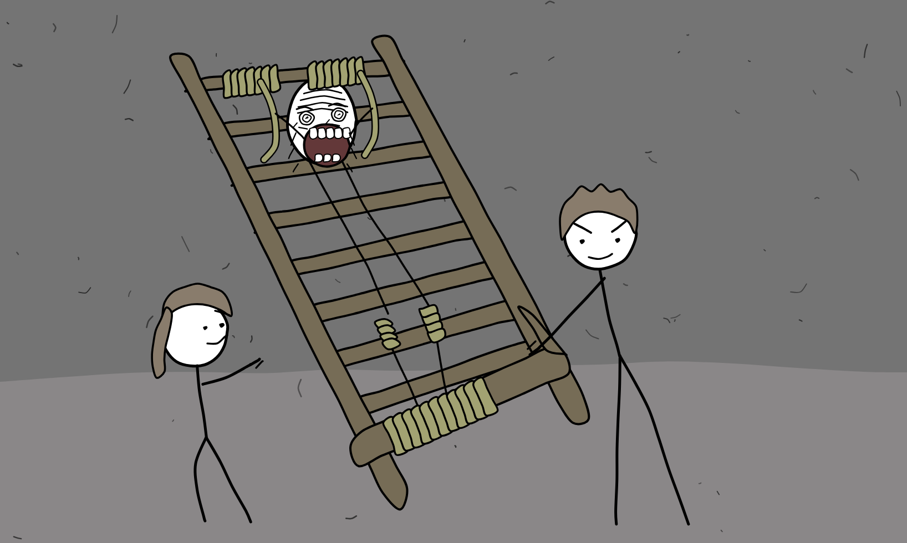

# Style Lab — flat stick-figure cartoon

Answer to "is there open-source software that draws *this* style?" — yes, and more
than one. This folder is the proof: a redraw of a reference frame, generated from
code, no proprietary tool anywhere in the chain.



`out/compare.png` puts the reference above the redraw at matched scale.

---

## Why this style is a good fit for FOSS

It uses none of the things open tools are historically weaker at. No gradients,
no soft shadows, no photographic texture, no 3D. Stripped down it is only:

| Ingredient | Detail (measured off the reference, not guessed) |
|---|---|
| Palette | **5 colours carry 85% of the frame** — wall `#747474` 53%, ground `#8a8788` 27%, white `#ffffff`, wood `#766c56`, rope `#a2a272` |
| Horizon | a soft colour change, **no line**, gently wavy, y≈651–689 |
| Contour | one black weight, ~5px at 1636px wide; interior detail ~2.6px |
| Fills | flat, no shading, contour drawn on top of its own fill |
| Line quality | low-frequency wobble — drawn, not ruled. This is the whole look |
| Grain | ~90 dark flecks per frame, median 6px long, a few up to 37px |
| Faces | 4 marks (2 eyes, brow, mouth) — except the one gag face, which gets 30 |

The comedy engine is that last row: everything is drawn at minimum effort *except*
one element rendered at maximum effort. Copy the flecks and the wobble and you are
90% there; copy the effort gap and you are done.

## The tools

**To draw it by hand**

- **Krita** — the one already in this repo's pipeline. Brush `Ink_gpen_25` for the
  contour, Fill tool (Contiguous, Grow 2px) for the flats. Best for finished frames.
- **Inkscape** — vector version. Pencil tool (`P`) with Smoothing ~30, or the
  Calligraphy tool for the tapered ends. Use when you need to recolour or rescale later.
- **GIMP / MyPaint** — workable, but weaker fill and stroke handling than Krita here.

**To animate it**

- **Blender Grease Pencil** — best overall, and already in the pipeline. Its
  **Noise modifier** is literally the wobble implemented in `stickstyle.py`.
- **Synfig Studio** — cut-out puppets with tweening. Closest to how the Flash-era
  shows this style comes from were actually made.
- **OpenToonz** — full traditional 2D pipeline. Heaviest, most capable.
- **Pencil2D** — simplest frame-by-frame. Good for tests.
- **Glaxnimate** — SVG/Lottie, if the target is web.

**To generate it from code** — what is in this folder. Deterministic (seeded, so a
frame redraws identically), resolution-independent, and scriptable to 24 fps.

## What is here

```
stickstyle.py     ~200-line engine: wobble pen, flat-fill shapes, rope coils, flecks
scene_ladder.py   the scene — measured geometry, hand-placed expression
render.cjs        SVG -> PNG via headless Chromium (already installed for Playwright)
out/              ladder.svg, ladder.png, compare.png
```

```bash
python3 scene_ladder.py
NODE_PATH=/opt/node22/lib/node_modules node render.cjs "$PWD/out/ladder.svg" "$PWD/out/ladder.png" 1636 980
# same SVG at 4K, since it is vector:
NODE_PATH=/opt/node22/lib/node_modules node render.cjs "$PWD/out/ladder.svg" "$PWD/out/4k.png" 1636 980 2.348
```

## How the wobble works

The only non-obvious part. Every mark goes through the same three steps:

1. **Resample** the polyline every ~36px. Sample spacing sets the wobble's
   wavelength — this is the knob that matters most.
2. **Displace** each sample along its local normal by `sin(i·freq + phase) · amp`
   plus a little noise. Low frequency reads as *drawn*; high frequency reads as
   *shaky*, which is a different and worse look.
3. **Catmull-Rom** through the displaced points, emitted as cubic béziers.

Fill and contour come from one path, so they can never drift apart. Amplitude runs
1–2.5px; past ~4px it stops looking hand-drawn and starts looking melted.

## Porting the look to the Dancing Plague film

The measurement method transfers even though the palette does not. For any
reference frame: mask on its flat colours to recover geometry, count the flecks,
measure the stroke width. Then in Blender set Grease Pencil **Noise** to the
amplitude above, and keep the ColorRamp on `Constant` (see
`../dancing-plague-1518/PIPELINE-krita-blender.md`) — flat cel bands are the same
decision as the flat fills here.

Two things carry across regardless of style: the horizon as a colour change with
no line, and rationing detail so one element in the frame is drawn much harder
than everything around it.
